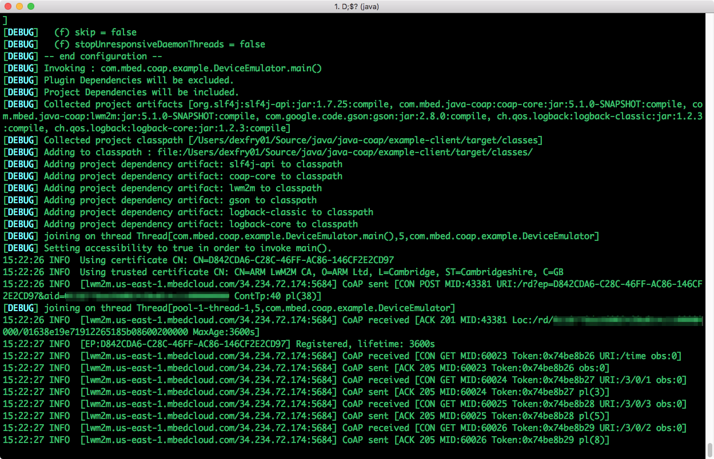
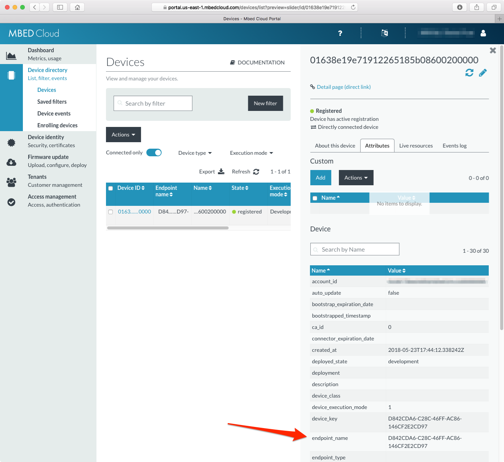
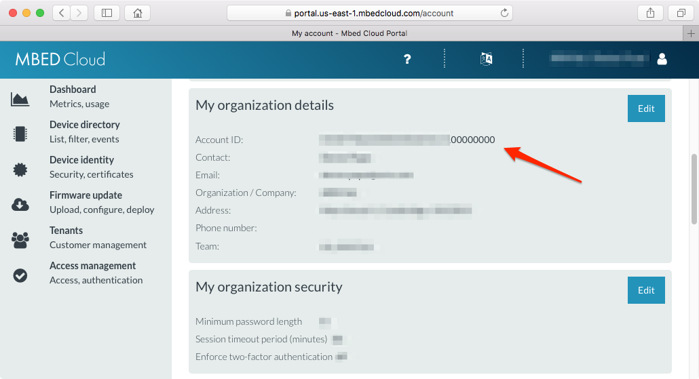
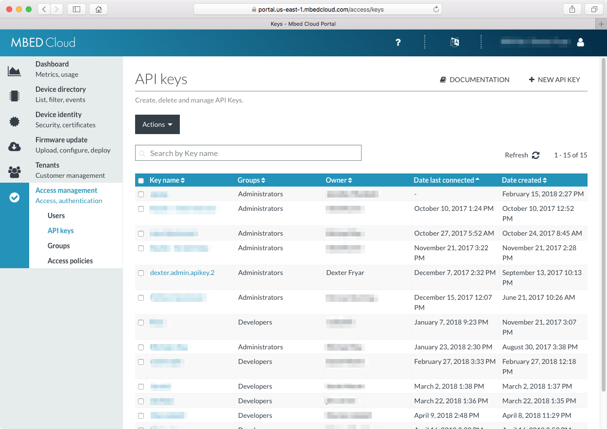
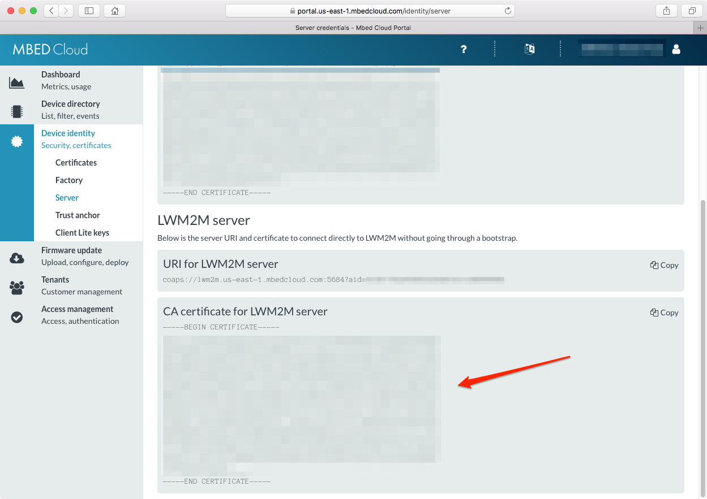
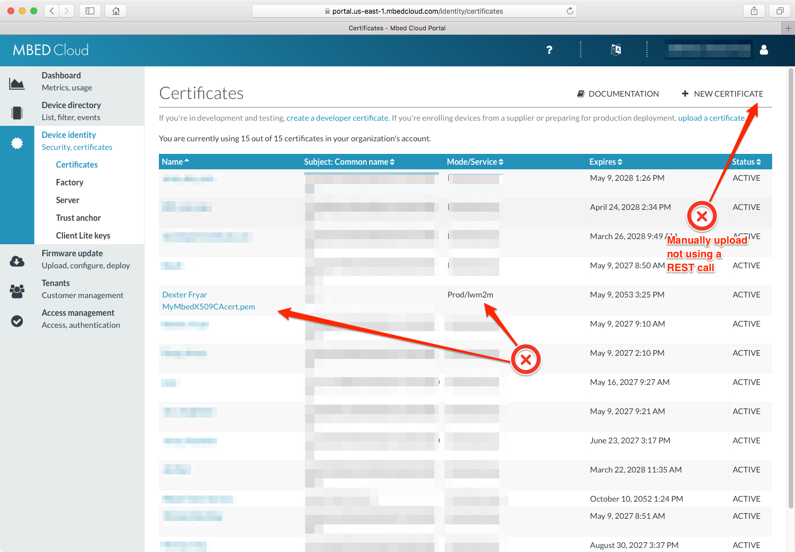

Example CoAP client
===================

This is an example coap client application, that can be use with any LwM2M Server.

# Running

Usage
-----

    ./run.sh <registration-url> [<keystore-file>]

note: parameters are parsed like a [www URL query string](https://en.wikipedia.org/wiki/Query_string) where ? and & are delimeters for the endpoint name and account ID

*For example:*
    
    cd java-coap/example-client

    ./run.sh "coaps://lwm2m.us-east-1.mbedcloud.com:5684/rd?ep=${ENDPOINT_NAME}&aid=${ACCOUNT_ID}" ../keystore/example-client-device-keystore.jks



    *note: replace ${ENDPOINT_NAME} and ${ACCOUNT_ID} with the value defined in the Configuring section below*

*${ENDPOINT_NAME} can be obtained by running the following command*
```
keytool -list -v -storepass secret -keystore example-client-device-keystore.jks 2> /dev/null | grep 'Alias name: mbed-cloud'
```



# Building with Maven

#### Clone java-coap

```
git clone https://github.com/ARMmbed/java-coap
```

### Change to the project

```
cd java-coap
```

### Maven install the project

```
mvn package install -DskipTests
```

# Configuring

## Generating Keystore, Certificates, Security Keys

### Set these variables which can be retrieved from https://portal.us-east-1.mbedcloud.com/account

```
ACCOUNT_ID=xxxxxxxxxxxxxxxxxxxxxxxxxxxxxxxx
```



### Set these variables which can be retrieved from https://portal.us-east-1.mbedcloud.com/access/keys

```
API_KEY=ak_xxxxxxxxxxxxxxxxxxxxxxxxxxxxxxxxxxxxxxxxxxxxxxxxxxxxxxxxxxxxxxxxxxxxxxxxxxxxxxxxxxxxxxxxxxxxxxxxxxxxxxxxxxxx
```



### Use uuidgen tool to generate a unique endpoint name

```
ENDPOINT_NAME=$(uuidgen)
```

### Make a directory to store your keystore, certificates, and security keys

```
mkdir keystore && cd keystore
```

### Issue a REST call via cURL command to get the LWM2M server certificate from the Mbed Cloud endpoint (lwm2m-east-1.mbedcloud.com) extract the server cert and dump it to a PEM file

Note: you can also cut and paste this from the Portal

```
curl -s -X GET \
  https://api.us-east-1.mbedcloud.com/v3/server-credentials/lwm2m \
  -H 'Authorization: Bearer '"${API_KEY}"'' \
  -H 'Cache-Control: no-cache' \
  -H 'Content-Type: application/json' | jq -r '."server_certificate"' > lwm2m_server_ca_certificate.pem
```



### Personal Self Signed Certificate Authority

### Create private key for the LWM2M CA certificate

* [Properties for manually generated keys and certificates](https://cloud.mbed.com/docs/current/provisioning-process/index.html)

* [Setting up your own certificate authority](https://cloud.mbed.com/docs/v1.2/provisioning-process/setting-up-your-own-certificate-authority.html)

```
openssl ecparam -out my_ca_private_key.pem -name prime256v1 -genkey
```

### Sign a CA with our private key and the CA will be uploaded to mbedcloud

```
openssl req -key my_ca_private_key.pem -new -sha256 -x509 -days 12775 -out my_ca_public_cert.pem -subj /CN=CA -config <(echo '[req]'; echo 'distinguished_name=dn'; echo '[dn]'; echo '[ext]'; echo 'basicConstraints=CA:TRUE') -extensions ext
```
## LWM2M Device Certificates

### Create device private key

```
openssl ecparam -out lwm2m_device_private_key.pem -name prime256v1 -genkey
```

### Convert private key to DER format

```
openssl ec -in lwm2m_device_private_key.pem -out lwm2m_device_private_key.der -outform der
```

### Create a certificate signing request (CSR) for the private key

```
openssl req -key lwm2m_device_private_key.pem -new -sha256 -out lwm2m_device_private_key_csr.pem -subj /CN=${ENDPOINT_NAME}
```

### Sign the certificate signing request (CSR) with the CA private key and certificate -

```
openssl x509 -req -in lwm2m_device_private_key_csr.pem -sha256 -out lwm2m_device_cert.der -outform der -out lwm2m_device_cert.pem -outform pem -CA my_ca_public_cert.pem -CAkey my_ca_private_key.pem -CAcreateserial -days 3650
```

## Java Keystore

#### Create a PKCS #12 archive to store cryptography objects so we can create a Java keystore from it

```
openssl pkcs12 -export -in lwm2m_device_cert.pem -inkey lwm2m_device_private_key.pem -out my_lwm2m_device_keystore_certs.p12 -name mbed-cloud-${ENDPOINT_NAME} -password pass:secret
```

#### Create Java keystore importing the PKCS #12 archive

```
keytool -keystore example-client-device-keystore.jks -storepass secret -importkeystore -srcstorepass secret -srckeystore my_lwm2m_device_keystore_certs.p12 -srcstoretype PKCS12 -noprompt
```

#### Import our CA cert we created above to the Java keystore

```
keytool -keystore example-client-device-keystore.jks -storepass secret -import -alias lwm2m_server_ca_certificate -file lwm2m_server_ca_certificate.pem -noprompt
```

## Convience Commands Viewing/Verifying Keys, Certs, Keystore

### Dump the contents of the certs we created for convience

```
openssl pkcs12 -in my_lwm2m_device_keystore_certs.p12 -nodes -passin pass:secret | openssl x509 -noout -subject
openssl x509 -in my_ca_public_cert.pem -noout -text | grep Subject:
openssl x509 -in lwm2m_server_ca_certificate.pem -noout -text | grep Subject:
openssl x509 -in lwm2m_device_cert.der -inform der -text -noout
```

### Examine the keystore

```
keytool -list -v -storepass secret -keystore example-client-device-keystore.jks
```

## Mbed Cloud Certificate Uploading

### Output a hash of our private key plus account nexus in base64 for mbedcloud verification

Note: You only need this if you are uploading the cert with using the Portal UI

```
printf "${ACCOUNT_ID}" > account_id && openssl dgst -sha256 -sign my_ca_private_key.pem -out sign.sha256 account_id && base64 sign.sha256
```

### Get a json payload file to upload the results with cURL if you didn't do this via Portal

```
CERT=$(cat my_ca_public_cert.pem | sed -e ':a' -e 'N' -e '$!ba' -e 's/\n/\\n/g')

echo -n "{\"name\": \"My Java-example my_ca_public_cert.pem\", \"description\": \"LWM2M self signed certificate for testing https://github.com/ARMmbed/java-coap/example-client\", \"certificate\": \"${CERT}\", \"service\": \"lwm2m\"}" > payload.json
```

### Upload the certificate to Mbed Cloud if you didn't use the portal

```
curl -X POST \
  -d @payload.json \
  -H 'Content-Type: application/json' \
  -H 'Authorization: Bearer '"${API_KEY}"'' \
  -H 'Cache-Control: no-cache' \
  https://api.us-east-1.mbedcloud.com/v3/trusted-certificates
```

note: Using the [Portal UI](https://portal.us-east-1.mbedcloud.com/identity/certificates) you can verify the certificate is now in place



# Troubleshooting

### Known Issues or Workarounds

[Timeout trying to connect to arm mbed remote server](https://github.com/ARMmbed/java-coap/issues/3)
